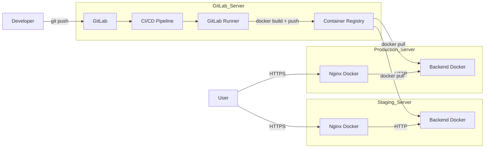
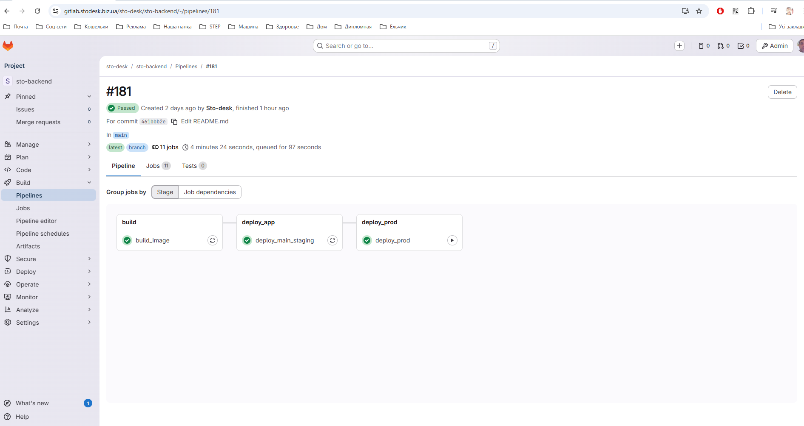
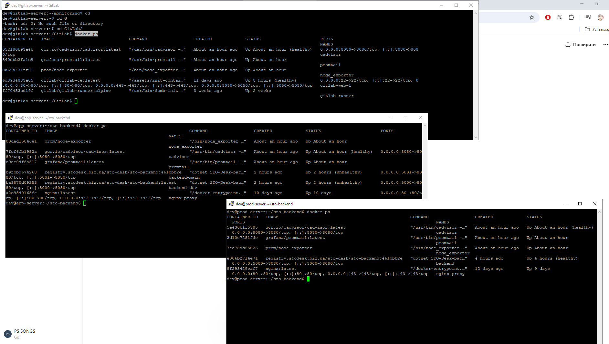
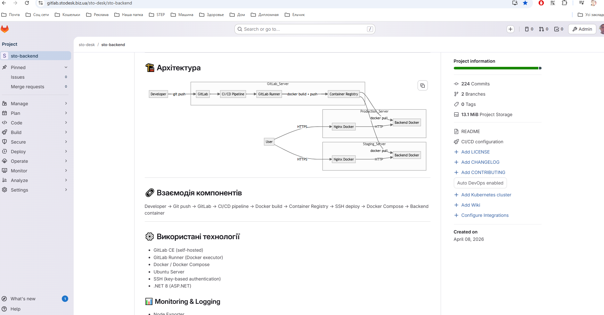
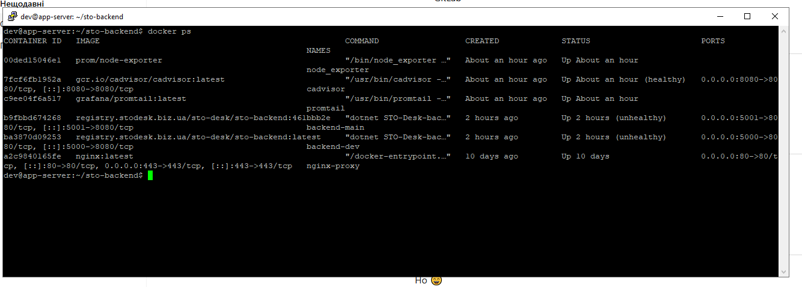
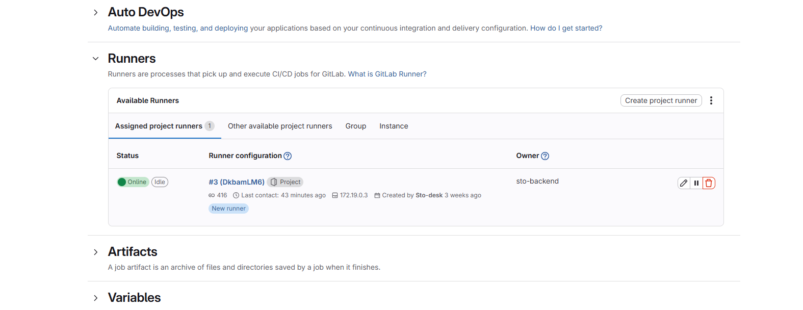

# STO Service Desk — Backend Infrastructure

Інфраструктура для дипломного проєкту — Service Desk системи для СТО.

Проєкт охоплює повний цикл розгортання backend-застосунку:

* контейнеризація через Docker
* CI/CD автоматизація
* staging та production deployment
* використання GitLab Container Registry
* моніторинг та логування
* базова оптимізація інфраструктури
* синхронізація GitHub ↔ self-hosted GitLab

---

# 🔄 Статус проєкту

* Backend успішно розгорнуто на Staging Server
* Production сервер налаштований та працює стабільно
* GitLab CI/CD pipeline автоматизований
* Використовується GitLab Container Registry
* Реалізовано deploy через Docker Compose
* Налаштовано monitoring stack
* Проведено cleanup та optimization Docker Registry
* Реалізовано синхронізацію GitHub ↔ GitLab

---

# ✅ Key Features

* Self-hosted GitLab infrastructure
* Automated CI/CD pipelines
* Docker-based deployment
* Separate staging and production environments
* GitLab Container Registry integration
* SSH-based deployment automation
* Monitoring & logging stack
* Docker Registry cleanup & optimization
* Basic infrastructure hardening
* Repository synchronization between GitHub and GitLab

---

# 🖥️ Сервери

| Сервер            | Роль                             |
| ----------------- | -------------------------------- |
| GitLab Server     | CI/CD + Registry + GitLab Runner |
| Staging Server    | Dev / staging environment        |
| Production Server | Production environment           |

---

# 🏗️ Архітектура



---

# 🔗 Взаємодія компонентів

Developer
→ Git push
→ GitLab
→ CI/CD pipeline
→ Docker build
→ Container Registry
→ SSH deploy
→ Docker Compose
→ Backend container

---

# ⚙️ Використані технології

* GitLab CE (self-hosted)
* GitLab Runner (Docker executor)
* Docker / Docker Compose
* Ubuntu Server
* SSH (key-based authentication)
* .NET 8 (ASP.NET)

## 📊 Monitoring & Logging

* Node Exporter
* cAdvisor
* Promtail

---

# 🔁 CI/CD Pipeline

## Flow

1. Push у гілку `dev` або `main`
2. Запуск GitLab pipeline
3. Build Docker image
4. Push image у GitLab Container Registry
5. Deploy через SSH

---

## Staging Deploy

* автоматичний deploy
* використовується latest або commit-based tag
* оновлення через Docker Compose

---

## Production Deploy

* manual deploy
* використовується commit-based image tag
* оновлення через:

```bash
docker compose pull
docker compose up -d --force-recreate
```

---

# 🐳 Docker Deploy

## Структура серверів

```bash
~/sto-backend
├── docker-compose.yml
└── .env
```

## Використання Docker Compose

* запуск backend контейнера
* оновлення через image tag
* healthcheck контейнера
* автоматичний restart (`restart: always`)

---

# 🔄 Синхронізація репозиторіїв

Було реалізовано синхронізацію backend-репозиторіїв між GitHub та self-hosted GitLab.

## Виконані задачі

* налаштовано Git remotes
* виправлено SSH access та known_hosts
* синхронізовано dev та main гілки
* виконано merge repository
* вирішено merge conflicts у `.csproj`
* виправлено dependency conflicts (.NET 8)
* відновлено GitLab CI/CD pipeline
* перевірено Docker build та deploy
* оновлено README та architecture diagram

---

# 🧹 Оптимізація інфраструктури

* очищено Docker Registry
* налаштовано Cleanup Policy
* виконано Garbage Collection
* очищено зайві контейнери та runner-и
* оптимізовано серверні ролі

---

# 🔒 Безпека

* SSH доступ тільки через ключі
* password authentication вимкнено
* приватні ключі зберігаються у GitLab CI/CD Variables
* видалено небезпечні Git токени
* використовується авторизація Container Registry через CI

---

# 📊 Моніторинг

## Метрики

* CPU
* RAM
* Disk
* Containers
* Network
---

# 📌 Skills Demonstrated

* CI/CD automation
* Docker containerization
* Infrastructure management
* GitLab administration
* Docker Registry management
* SSH deployment automation
* Monitoring & logging
* Infrastructure troubleshooting
* Basic security hardening
* Repository synchronization

  ## CI/CD Pipeline


## Docker Infrastructure


## Architecture


## Application Server


## GitLab Runner

