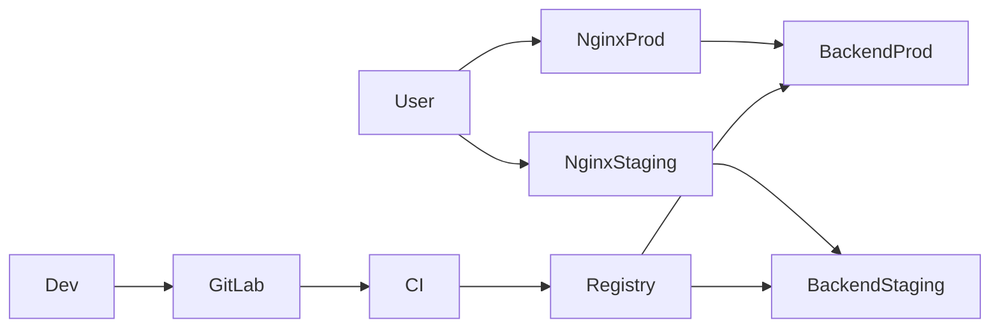

# 🚀 STO Service Desk — Backend Infrastructure

Інфраструктура для дипломного проєкту (Service Desk для СТО).
Реалізовано повний цикл: **CI/CD → контейнеризація → деплой → моніторинг**

---

## 🔥 Основні можливості

* Docker, Docker Compose (containerized deployment)
* GitLab CI/CD + Container Registry
* Staging + Production середовища
* Nginx reverse proxy + HTTPS (Let's Encrypt, DNS challenge)
* Моніторинг (Node Exporter, cAdvisor, Promtail)
* Оптимізація ресурсів

---

## 🔄 Статус

* Backend розгорнуто (staging + production)
* CI/CD повністю автоматизовано
* Реалізовано containerized деплой через Docker Compose
* Налаштовано HTTPS (wildcard *.stodesk.biz.ua)
* Моніторинг та оптимізація працюють

---

## 🖥️ Сервери

| Сервер | Роль                    | IP          |
| ------ | ----------------------- | ----------- |
| GitLab | CI/CD, Registry, Runner | 172.17.2.20 |
| App    | Staging                 | 172.17.2.22 |
| Prod   | Production              | 172.17.2.23 |

---

## 🧠 Архітектура




**Flow (коротко):**
Developer → Git push → GitLab → CI/CD → Docker build → Registry → Deploy → Nginx → Backend

---

## 🔗 Взаємодія компонентів

Developer
→ GitLab (push)
→ CI/CD pipeline
→ Docker build
→ Container Registry
→ SSH deploy
→ Docker Compose
→ Backend container
→ Nginx

---

## ⚙️ Технології

* GitLab CE (self-hosted), GitLab Runner
* Docker / Docker Compose
* Ubuntu Server
* Nginx (reverse proxy)
* .NET 8 (ASP.NET)
* SSH (key-based auth)

**Моніторинг:** Node Exporter, cAdvisor, Promtail

---

## 🔁 CI/CD

**Flow:**
push → pipeline → build → registry

**Deploy:**

* staging — автоматично
* production — manual

**Update:**

```bash
docker compose pull
docker compose up -d --force-recreate
```

---

## 🐳 Docker

* запуск backend контейнера
* versioning через image tag
* healthcheck
* restart: always

---

## 🚀 Production Experience

* додано `/health` endpoint
* post-deploy перевірка (curl)
* виправлено доступ до Registry (deploy token)
* стабільний деплой через CI/CD

---

## 🌐 Nginx + HTTPS

* окремий Docker-контейнер
* reverse proxy
* Let's Encrypt (DNS challenge)
* wildcard сертифікат (*.stodesk.biz.ua)

---

## 🔐 Мережа

* ізольована мережа (172.17.x.x)
* /etc/hosts для резолву

```
172.17.2.22 api.stodesk.biz.ua
172.17.2.20 gitlab.stodesk.biz.ua
```

---

## 🔒 Безпека

* SSH тільки по ключах
* парольна авторизація вимкнена
* CI/CD secrets у GitLab
* registry auth через deploy token

---

## 🧹 Оптимізація

* cleanup policy
* garbage collection
* docker prune
* розділення ролей серверів

---

## 📊 Моніторинг

CPU / RAM / disk / containers / network

---

## 💾 Backup

* GitLab (repos, DB, registry)
* конфіги (nginx, docker-compose, SSL)
* окремий сервер

**Формат:**

```
backup_YYYY-MM-DD.tar.gz
```

Відновлення через Docker Compose + Registry

---

## 📌 Висновок

Проєкт демонструє практичну реалізацію DevOps підходів:
CI/CD, Docker, інфраструктура, безпека, моніторинг та оптимізація.

Інфраструктура стабільна та готова до масштабування.

  ## CI/CD Pipeline


## Docker Infrastructure


## Architecture


## Application Server


## GitLab Runner

