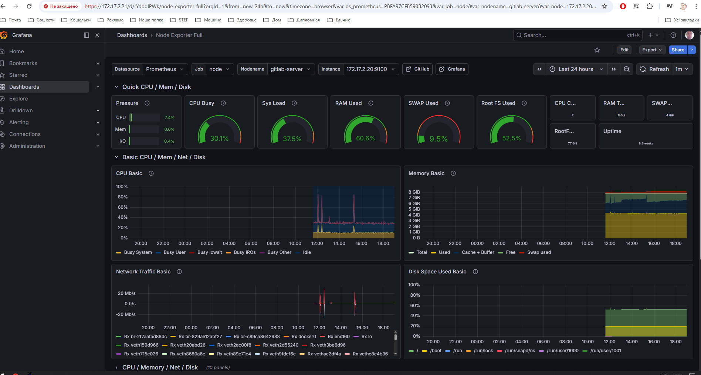

# Monitoring Stack

## Overview

The infrastructure monitoring stack is used to collect:

- Host metrics
- Container metrics
- Logs
- System health information

---

## Components

### Node Exporter

Collects Linux host metrics:

- CPU usage
- RAM usage
- Disk usage
- Network statistics

---

### cAdvisor

Collects Docker container metrics:

- Container CPU usage
- Memory consumption
- Network traffic
- Running containers

---

### Promtail

Collects and forwards logs to Grafana stack.

---

### Grafana

Used for:

- Metrics visualization
- Dashboards
- Monitoring analysis

---

## Screenshots

### Grafana Dashboard

### Docker Containers

### GitLab Runner

